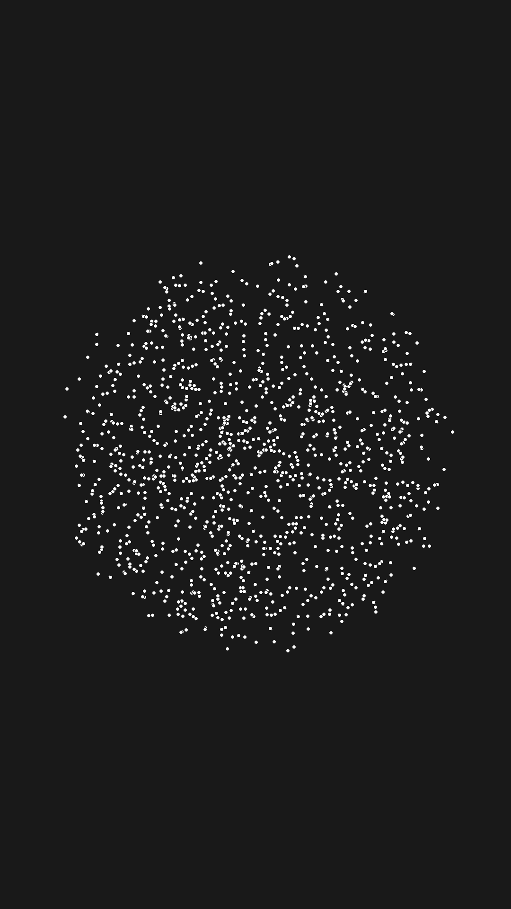
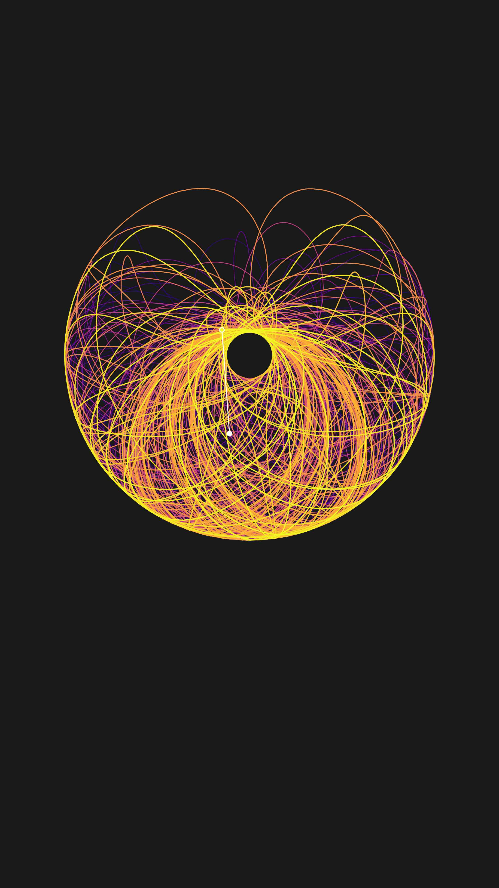
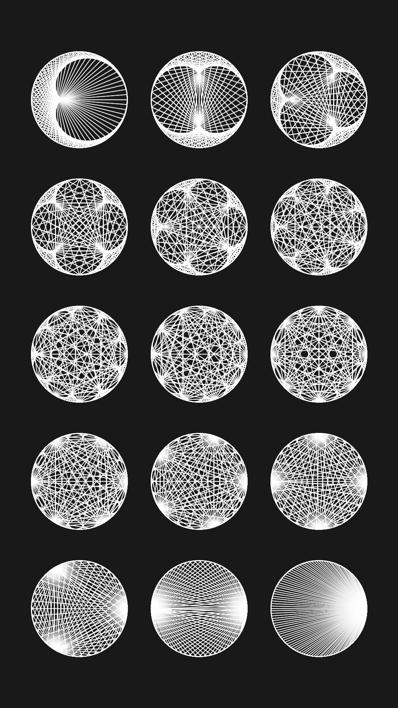
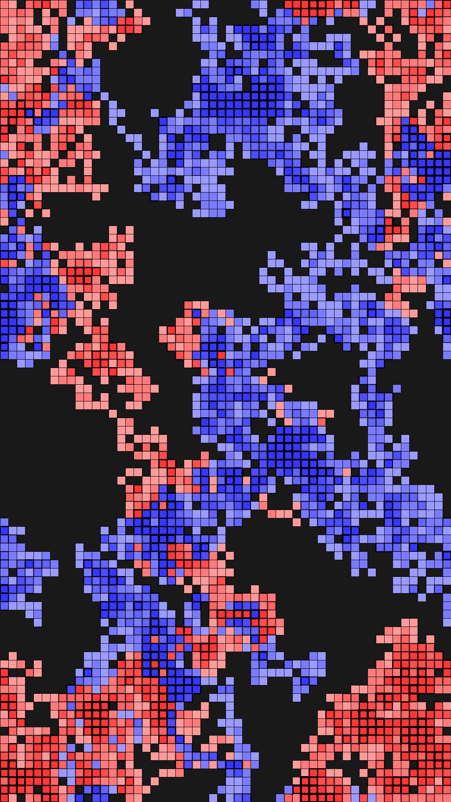
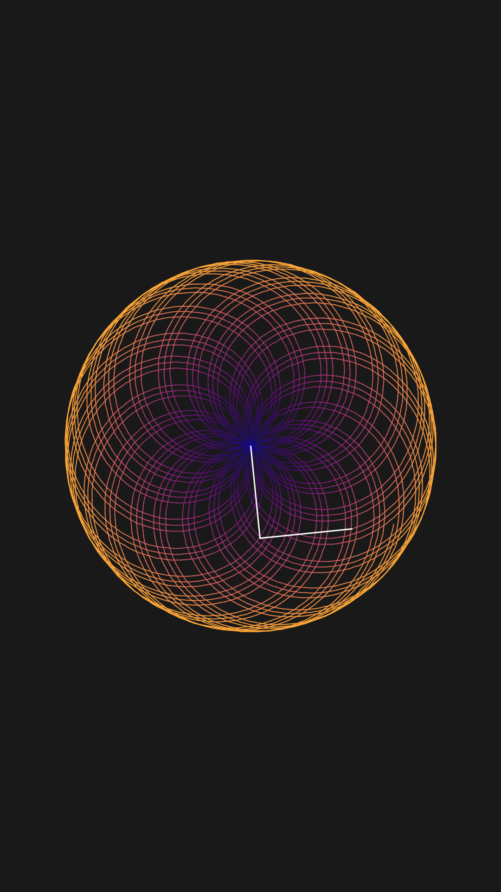
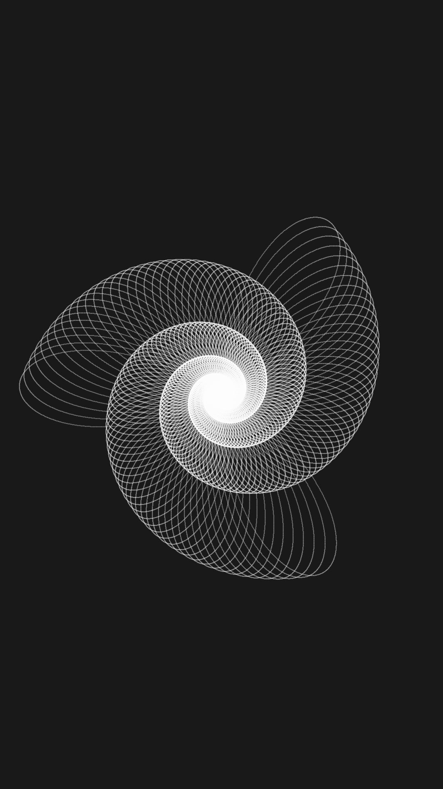
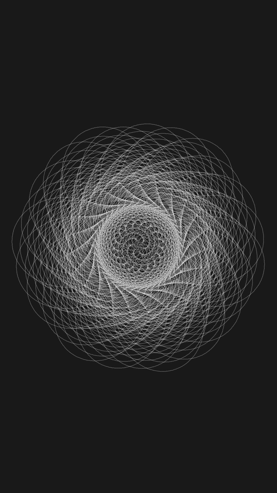
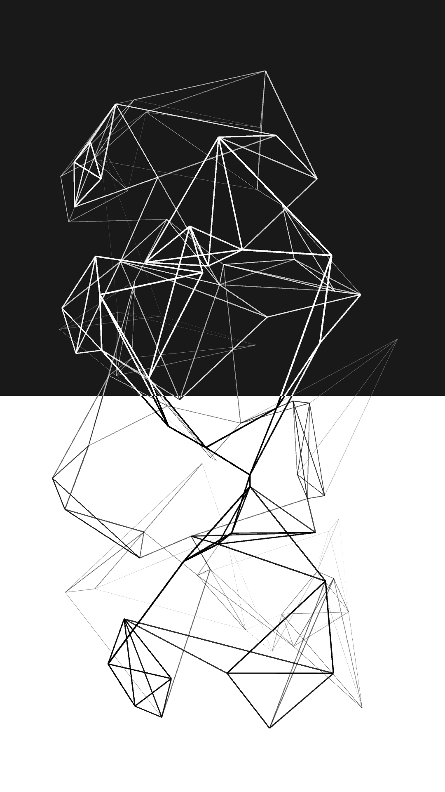

# 数字线条 Processing 编程艺术

数字线条的编程艺术原创代码

简体中文 | [English](./README.en.md)

## 预览

| 预览 | 链接 | 预览 | 链接 |
|:-------:|------|:-------:|------|
| [ <b>呼吸</b>](breath) | [查看代码](breath) | [ <b>中国城市连接</b>](china_city_connection) | [查看代码](china_city_connection) |
| [ <b>分形树展开</b>](fractal_tree_unfolding) | [查看代码](fractal_tree_unfolding) | [ <b>洛伦兹吸引子</b>](lorenz_attractor) | [查看代码](lorenz_attractor) |
| [ <b>圆中的点</b>](dot_in_circle) | [查看代码](dot_in_circle) | [ <b>双摆</b>](double_pendulum) | [查看代码](double_pendulum) |
| [ <b>模数圆</b>](modular_circle) | [查看代码](modular_circle) | [ <b>模数圆网格</b>](modular_circle_grid) | [查看代码](modular_circle_grid) |
| [ <b>心跳</b>](heart_beat) | [查看代码](heart_beat) | [ <b>沃罗诺伊图</b>](voronoi_diagram) | [查看代码](voronoi_diagram) |
| [ <b>随机游走</b>](random_walk) | [查看代码](random_walk) | [ <b>蒙德里安生成器</b>](mondrian_generator) | [查看代码](mondrian_generator) |
| [ <b>分形树风</b>](fractal_tree_wind) | [查看代码](fractal_tree_wind) | [ <b>螺旋绘图</b>](spiral_draw) | [查看代码](spiral_draw) |
| [ <b>螺旋绘图 2</b>](spiral_draw_2) | [查看代码](spiral_draw_2) | [ <b>和谐图近失</b>](harmonograph_near_misses) | [查看代码](harmonograph_near_misses) |
| [ <b>和谐图泛音</b>](harmonograph_overtone) | [查看代码](harmonograph_overtone) | [ <b>照相图</b>](photogram) | [查看代码](photogram) |
| ... | ... | ... | ... |

## 如何运行

要运行这些草图，您需要在计算机上安装 Processing IDE。您可以从[Processing 官网](https://processing.org/download/)下载 Processing IDE。安装完成后，请按照以下步骤操作：

1. 将此存储库克隆到您的本地计算机。
2. 打开 Processing IDE，并从“文件”菜单中选择“打开...”。 
3. 导航到克隆的存储库文件夹，并打开草图文件夹中的任何 `.pde` 文件。
4. 按 IDE 中的“运行”按钮以编译和运行草图。

或者，您也可以使用 [Processing 开发环境 (PDE)](https://processing.org/reference/environment/) 探索和修改这些草图，它提供了一种简便的方法来处理 Processing 项目。

## 许可证

本项目根据 MIT 许可证授权 - 有关详细信息，请参见 [LICENSE.md](LICENSE) 文件。
