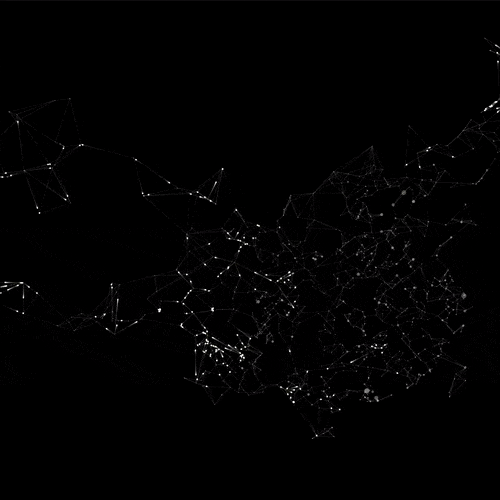

# Dynamic Processing Animations 

Welcome to this repository! Here, you will find an assortment of animations made with the flexible and highly expressive creative coding tool, [p5.js](https://p5js.org/). This is a great place to learn, understand, and draw inspiration from code that uses [Processing](https://processing.org/), a software sketchbook and language aimed at teaching code in a visual context.

This code is open source and encourages creative exploration. Feel free to use it as a springboard for your own imaginative projects!

## Animations in this Repository

### Breath Meditation

Let your stress melt away with this hypnotic animation. Breath visualizes a calming, zooming green dot that effortlessly ebbs and flows. Use it as an aid in your meditation practice; follow the rhythm of the dot as you attune your breath to its tranquil motion. Let it guide you to a state of deep calm and mindfulness.

Take a look at the animation here: 

### China City Connection

Experience the pulsating energy of a city's expansion in China City. This animation features dots spreading out from a central location, ultimately spanning across the entire representation of a country. Witness the spread of activity from a solitary hub to the bustling buzz of a nationwide network. 

View the dynamic spread here: 

## Getting Started 

To run these animations locally on your machine, clone this repository, and run it through Processing.

Thanks for visiting, and happy coding!