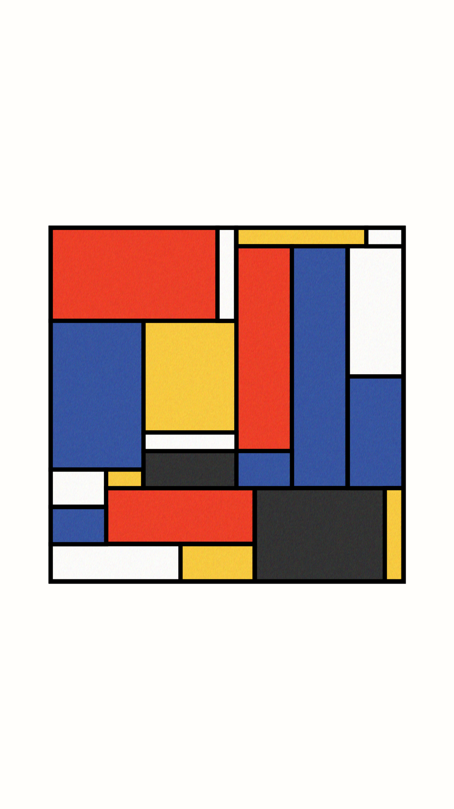
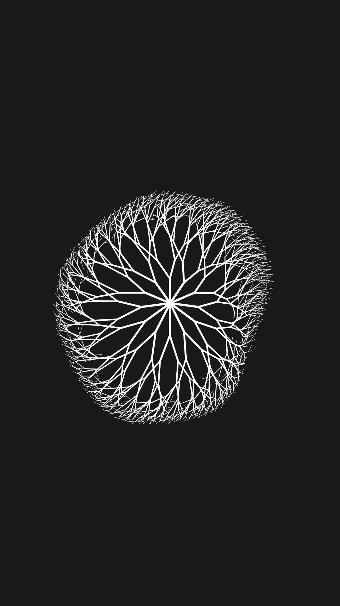

# DigitLine Processing Programming Art

DigitLine's Programming Art Original Code

## Preview

| Preview | Link | Preview | Link |
|:-------:|------|:-------:|------|
|  <b>Breath</b> | [View Code](breath) |  <b>China City Connection</b> | [View Code](china_city_connection) |
|  <b>Fractal Tree Unfolding</b> | [View Code](fractal_tree_unfolding) |  <b>Lorenz Attractor</b> | [View Code](lorenz_attractor) |
|  <b>Dot In Circle</b> | [View Code](dot_in_circle) |  <b>Double Pendulum</b> | [View Code](double_pendulum) |
|  <b>Modular Circle</b> | [View Code](modular_circle) |  <b>Modular Circle Grid</b> | [View Code](modular_circle_grid) |
|  <b>Heart Beat</b> | [View Code](heart_beat) |  <b>Voronoi Diagram</b> | [View Code](voronoi_diagram) |
|  <b>Random Walk</b> | [View Code](random_walk) |  <b>Mondrian Generator</b> | [View Code](mondrian_generator) |
|  <b>Fractal Tree Wind</b> | [View Code](fractal_tree_wind) |  <b>Harmonograph Near Misses</b> | [View Code](harmonograph_near_misses) |
|  <b>Harmonograph Overtone</b> | [View Code](harmonograph_overtone) |  <b>Photogram</b> | [View Code](photogram) |
| ... | ... | ... | ... |

## How to Run

To run these sketches, you'll need to have the Processing IDE installed on your computer. You can download the Processing IDE from the [official Processing website](https://processing.org/download/). Once installed, follow these steps:

1. Clone this repository to your local machine.
2. Open the Processing IDE and select "Open..." from the File menu.
3. Navigate to the cloned repository folder and open any `.pde` file within the sketch folders.
4. Press the "Run" button in the IDE to compile and run the sketch.

Alternatively, you can explore and modify these sketches using the [Processing Development Environment (PDE)](https://processing.org/reference/environment/), which provides a straightforward way to work with Processing projects.

## License

This project is licensed under the MIT License - see the [LICENSE.md](LICENSE) file for details.